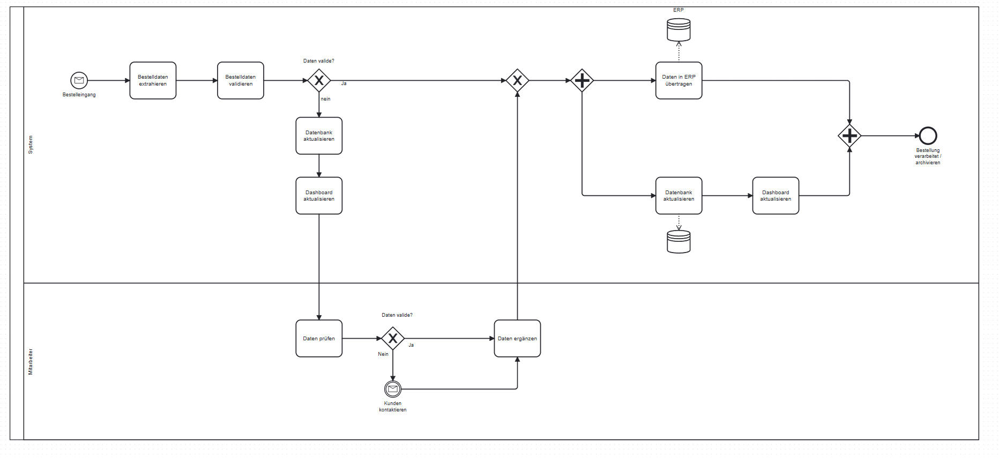

## Kurzbeschreibung



Dieses Projekt bildet einen digitalen Bestelleingangsprozess ab: eingehende Bestellungen werden aus Dokumenten extrahiert, validiert und verwaltet. Nutzer können Bestellungen prüfen, Fehlerfälle erkennen und den Status der Verarbeitung nachvollziehen.

Eine neue E‑Mail löst einen Hook aus. Anschließend werden aus der E‑Mail und dem Anhang die relevanten Informationen extrahiert. Zunächst wird das PDF in einem isolierten Container auf Viren geprüft. Danach extrahiert eine KI die Daten mittels OCR aus dem PDF oder der E‑Mail und validiert sie. Sind die Daten valide, werden sie ins ERP‑System übernommen. Andernfalls muss die Bestellung von einem Mitarbeitenden korrigiert werden. Sollte festgestellt werden, dass die KI einen Fehler beim Auslesen gemacht hat, sollte sie trainiert werden. Sind die Daten korrigiert, werden die Daten in das ERP-System übernommen.
Fälle wie automatische wie Lagerprüfung, Bestellbestätigung oder Bonitäsprüfung wurden in diesem Projekt nicht beachtet.

## Anleitung

Abhängigkeiten installieren

```bash
pnpm install
```

.env.local Variablen deklarieren

```
NEXT_PUBLIC_SUPABASE_URL=
NEXT_PUBLIC_SUPABASE_PUBLISHABLE_KEY=
```

Development server starten:

```bash
npm run dev
# or
yarn dev
# or
pnpm dev
# or
bun dev
```

## Getroffene Annahmen

- Die KI liefert strukturierte Datenfelder (Kunde, Positionen, Preise, Datum), die validierbar und sobald vorhanden korrekt sind.
- Die KI hat eine confidence von 100%
- Die Daten werden in ein ERP übernommen
- Rollen/Rechte, Benachrichtigungen und Folgeprozesse (Lager, Bonität, Versand) sind nicht Teil des Projekts.
- Es gibt keine Fehler beim Speichern der Bestellungen im ERP System

## Ausblick

- Deployment per Dockerfile + CI/CD image über GitHub Actions
- Speicherung der Anhänge Azure Blob storage / S3 storage

## Persönliche Reflexion

**Was lief gut:**

- UI‑Entwicklung mit shadcn: schnelle Umsetzung konsistenter Komponenten und Layouts.

**Herausforderungen:**

- Supabase Auth in Next.js (neu für mich, vorher mit better-auth bzw. Next Auth).
- Supabase Plattform allgemein, da ich bisher eher lokal mit Postgres oder MS SQL gearbeitet habe. (Berechtigungen/Data API)
- Neue Next.js Cache‑Funktionen lassen sich aktuell nicht sauber mit Supabase Auth kombinieren
- Neue Next.js Funktionen sind nicht immer sauber dokumentiert
- BPMN 2.0 war ungewohnt und brauchte Einarbeitung.
- Teilvalidierung wird nicht von zod unterstützt, es musste deshalb eine eigene Funktion geschrieben werden

**In einem echten Kundenprojekt:**

- Eine klare Data‑Access‑Layer und Dta Transfer Object für bessere Wartbarkeit.
- UI/UX‑Design vorab stärker konzeptionell festlegen (Designsystem/Layouts).
- Tabellen serverseitig oder clientseitig je nach Use‑Case differenziert planen (tablecn).
- Caching von Seiten, Komponenten und Funktionen
- Fehlende Kernfunktionen ergänzen: Bestellung aktualisieren, Rollen/Rechte, Benachrichtigungen.
- Robustere Validierung der Daten und ggf. Abgleich mit Bestandsdaten
- Bessere Datenbank Struktur (z.B. Produkte)
- Form Error Handling
- Optimistische Updates
- PDF's einsehen
- rate limiting
- Testen (Unit, E2E, User)
- Server seitiges filtering
- Ladeplaceholder
